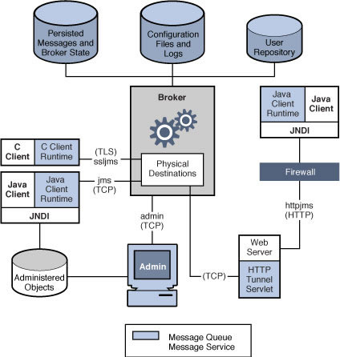

# Eclispe Open Message Queue -- Quick Start

_This page gives a brief overview of the main features of Eclipse Open MQ_

Eclipse Open MQ implements a reliable messaging mechanism to allow your applications to integrate together without relying on synchronous communications, and providing buffering between the message producers and message consumers. Eclipse Open MQ provides a unified building block that enables asychronous, loosely coupled integration and provides a common framework for administration, control, and monitoring. 

Open Message Queue is a full featured Message Oriented Middleware (MOM),  messaging server. Eclipse Open MQ implements the Java Message Service (JMS) API and provides enterprise class features such as:

* Loosely coupled messaging  between enterprise system components
* Scalable distribution of message servers (broker clustering) 
* Integrated SOAP / HTTP messaging
* Scalable JCA 1.5 compliant Resource Adapter
* Enterprise Administration Features
* Extensive JMX support 

A more complete feature list is available <a href="www/features.html">here</a>. 

<h2>Why use a message queue?</h2>

Message oriented integration has some advantages over direct integration between applications. Primarily, this allows the messaging infrastructure to operate as a buffer between your major system components. Additionally, messaging can provide a mechanism through which you can communicate with a disparate collection of system components, without necessarily knowing the details of those components. Since there's an integral buffer between the connected applications, each of these systems can operate at their own pace while the messaging infrastructure can absorb messages at the production rate, while they can be consumed at whatever rate the consumer is able to work through these messages.

Messaging is fundamentally different from an API call because your applications cannot know when the application at the other end of the communications link is going to receive the message and perform whatever actions are implied by that message. It is inherently asynchronous. Applications which require tight coupling may not be the best choice for a MOM intermediary. All actions between your systems are abstracted to a collection of messages which are exchanged via the JMS server, operating as an intermediary between your application end-points. Just because an application is asynchronous, does not mean that it cannot have high-throughput. In fact, many applications have been implemented which perform at very high message exchange rates. 

What MQ can ensure is that the messages will be operated in the proper order and, if there are any delivery problems, the infrastructure can know with certainty what the final delivery disposition was (success or failure). 
<h2>Eclipse Open MQ Installation</h2>

There are a few options available to you. The simplest is to download the GUI installer packages and follow the instructions from the installation application. If you want to download a smaller package, you can download the package archive -- without the installer. We call this a &quot;file based&quot; install. This will simply unpack the product where-ever you choose. You can then run the setup script to configure Eclipse Open MQ for the most general types of use. 

If you want to start from the source code, you'll need a copy of NetBeans (or a sufficiently equipped IDE). We provide instructions for building and then running a simple test application to verify that what you have built, is built properly. See the
[Downloads page](Downloads.md) for directions about how to obtain this package
<h2>Eclipse Open MQ Architecture and System Components </h2>

Here's a block diagram to orient you to the major system components of Eclipse Open MQ

<h2> Eclipse Open MQ Message Brokers</h2>

Message Brokers are the fundamental work-horses of Eclipse Open MQ. These server side applications manage all message exchanges between the clients who are producing and consuming messages. A message broker is responsible for managing a collection of message destinations. Clients can produce messages to, or consume messages from a message destination. A message destination can be configured as a message queue, or as a topic destination. Queues are used when you want messages to be handled with precise ordering and, when you need to ensure that delivery is guaranteed. Topic destinations are useful in &quot;Publish and Subscribe&quot; messaging. Pub-Sub messaging is useful for distributing messages to more than one consumer (though there's no reason you can't have only one consumer). Whereas, message &quot;queues&quot; are used when you need to ensure that messages are handled in an exact order, and with specific recovery and retry capabilities.

Brokers can be &quot;clustered&quot; for service and data redundancy. Messages Broker Clusters manage internal book-keeping between the &quot;Cluster Nodes&quot; to ensure that the rules for delivery are followed. 
<h2>Eclipse Open MQ Administration  </h2>

Eclipse Open MQ provides a simple, built-in administration GUI. This user interface provides for common tasks such as starting and stopping a message queue broker, creating destinations, and simple tasks. For more complex applications, we provide a rich Java Management Extensions (JMX) API. Through the JMX API, you can monitor and manage nearly any aspect of your Eclipse Open MQ system. Further, you can develop your own management controls via this API. If your project includes Java Enterprise System, then the Java Enterprise System Monitoring Framework is available for use with Eclipse Open MQ. Likewise, Java Composite Application Suite -- and the GlassFish Server application server also use the JMX API for controlling and managing Eclipse Open MQ operations. 
<h2>Eclipse Open MQ Message Storage Options</h2>

Eclipse Open MQ supports two basic types of message storage. You can use the embedded &quot;File-Store,&quot; or you can use a JDBC data-source. The embedded file-store is used if you make no changes to the default setting. This is optimized for use with Eclipse Open MQ and, in most applications will provide you with the highest system performance. Each Eclipse Open MQ Broker manages its own file-store. There are facilities for message distribution when using the embedded file-store, however, these do not provide continuous availability, in the event of a broker failure.

Many sites prefer using a common data storage layer, based on SQL. For these sites, Eclipse Open MQ supports databases via JDBC. JDBC does not provide as high a level of optimization for Messaging use. Additionally, all the optimizations which are available must be implemented in the database, as part of that products' administration utilities. In general, you can expect higher initial throughput when using the embedded file-store.

For high reliability and high-availability use, you must use a high-availability JDBC database. Eclipse Open MQ uses the jdbc database to store data and it implements a low-volume broker-to-broker communication protocol to resolve any run-time operational issues which are not appropriate within the database. Eclipse Open MQ can be configured for HA use with any JDBC database, but for maximum availability, you will want to deploy with a database that is resilient to failure, and provides complete internal data consistency and redundancy. Example HA databases include: HADB -- the JDBC data store which is included in Oracle GlassFish  Server (AKA Sun Java System Application Server 9.1); mySQL Cluster edition (with ndb storage); and Oracle. 
<h2>Eclipse Open MQ Java Client</h2>

Eclipse Open MQ provides a rich client API for developing your Java applications. If you are writing a stand-alone application you can integrate directly with Eclipse Open MQ via the Java client API. The API is much too rich to detail here. When you install the product, it includes complete javadoc. And, you can read the extensive manual in the MQ <a href="guides/readme">document collection</a>. For an index of all the documents, you can also browse over to the Document section of the [Downloads page](Downloads). 
<h2>Eclipse Open MQ C-Client</h2>

Many projects want to interface with a C based client. There is no standard for the C language, for JMS. This has been discussed as a possible extension, but so far, there's been no firm action taken on creating a C standard. So, every product has a slightly unique c-api which they use to <em>simulate</em> the Java JMS standard. Again, it's too rich to document here. You should read the programmers guide to the c-api which is available in the MQ <a href="guides/readme">document collection</a>, or via the link at the Eclipse Open MQ [Downloads page](Downloads.md). 
<h2>Eclipse Open MQ JMS over HTTP</h2>

You can work directly with JMS over HTTP using Eclipse Open MQ. This allows you to use remote clients that span across traditional fire-walls. This is detailed in the<a href="guides/mq-dev-guide-java/toc.html"> Java Client Developers Guide</a>, Chapter 5 &quot;Working With SOAP Messages&quot; 
<h2>Product Manuals</h2>

 If you're new to JMS Messaging, you might want to read the Overview Guide to become oriented to the product. You can get your hands dirty with the Admin. overview and Quick Start tutorial, in the <a href="guides/mq-admin-guide/toc.html">Administration Guide, Part 1, Introduction to MQ Administration</a> -- which will guide you through the basic administration function, followed by a tutorial. Following that, you might find the <a href="guides/mq-tech-over/toc.html">MQ Technical Overview</a> useful for planning and organizing how you want to approach your JMS project. 

There are also many tips and hints elsewhere on this site. 

